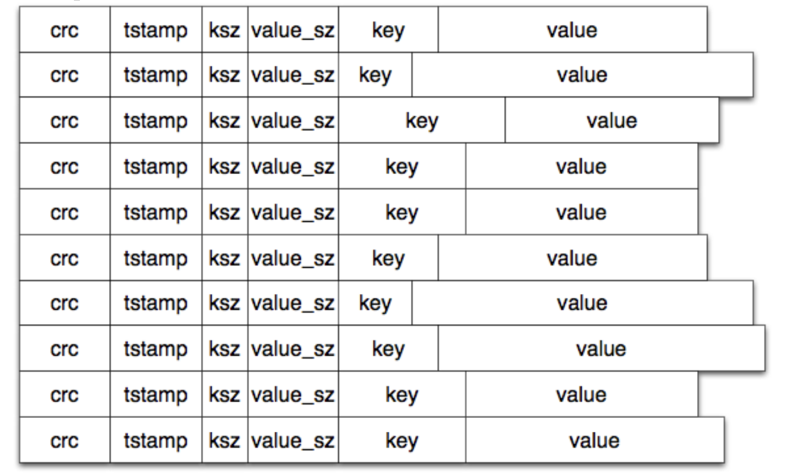
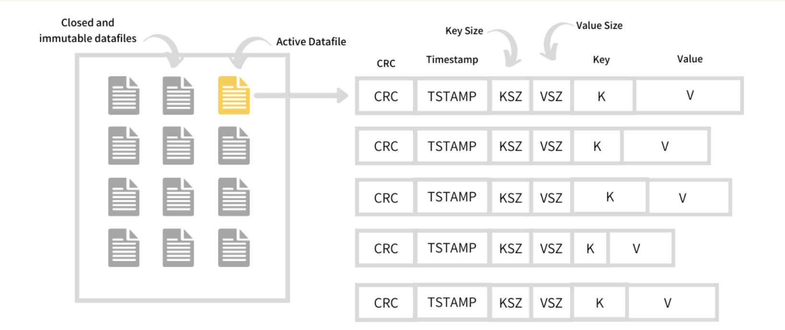

## Persist

- A log-structured key-value storage engine, written in C, inspired by Riak's [Bitcask](https://riak.com/assets/bitcask-intro.pdf) paper
- Designed to store variable-length key-value pairs
- Supports the following operations: `put`, `get`, `delete`

## How it works

- Key-value pairs are represented as byte-arrays, and stored on disk for persistence
  
- Keys are additionally stored in an in-memory hashtable (_keydir_) for quick lookups
  
- All writes are append-only operations, to minimize IOs
- Deletes create tombstones, which are cleaned up by the `merge` operation
- Each persist directory contains a `.metadata` file to keep track of the latest file being written to

## Usage

- **`make persist`** - creates the `persist` binary
- **`open <dirname>`** - opens a persist directory
- **`put <key> <value>`** - stores key-value pair
- **`get <key>`** - retrieves the value for a key
- **`delete <key>`** - deletes key-value pair
- **`merge`** - removes stale entries from the directory
- **`exit`** - stops the storage engine

## Credit

- _Images taken shamelessly from the Bitcask [paper](https://riak.com/assets/bitcask-intro.pdf) and from Arpit Bhayani's [blog](https://arpitbhayani.me/blogs/bitcask/)_
